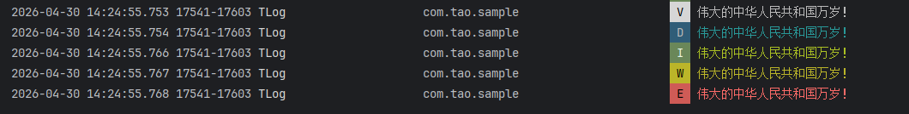
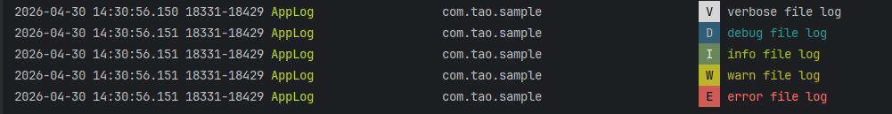
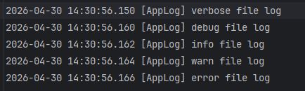

# TLog

TLog 是一个轻量级 Android 日志库，支持 Logcat 输出和本地文件记录。它适合在开发、测试和线上问题排查场景中统一管理日志输出。


## 特性

- 支持 `VERBOSE`、`DEBUG`、`INFO`、`WARN`、`ERROR` 五种日志级别。
- 支持全局默认 Tag，也支持单条日志临时指定 Tag。
- 支持长日志自动分片输出，避免 Logcat 单条日志过长被截断。
- 支持文件日志，`TLog.file()` 下的 `v/d/i/w/e` 会同时输出到 Logcat 和日志文件。
- 文件写入使用单线程后台队列处理，避免主线程写磁盘导致 UI 卡顿。
- 支持日志文件大小限制和文件数量限制，自动创建新日志文件并清理过期文件。
- 通过 `ContentProvider` 自动获取应用 `Context`，通常不需要手动在 `Application` 中初始化 Context。
- 支持自定义控制台输出器和文件输出器。

## 安装

在应用模块中添加依赖：

```kotlin
dependencies {
    implementation("io.github.wangjintao:tlog:2.0.0")
}
```

确保项目已经启用 `mavenCentral()`：

```kotlin
repositories {
    mavenCentral()
}
```


## 快速开始

不配置也可以直接使用，默认 Tag 为 `TLog`，文件日志默认保存在应用私有目录下的 `files/log`。

```kotlin
TLog.v(log)
TLog.d(log)
TLog.i(log)
TLog.w(log)
TLog.e(log)
```
<br>
在 `Application` 中可以按需配置：

```kotlin
class MyApp : Application() {
    override fun onCreate() {
        super.onCreate()

        TLog.init {
            defaultTag = "AppLog"//全局tag，默认TLog
            enableFileLogging = true//是否开启文件日志存储，默认true
            maxFileSizeBytes = 2L * 1024L * 1024L//单个日志文件大小，默认2M
            maxFileCount = 5//存储的最大日志文件个数,默认5
        }
    }
}
```

## Logcat 日志

普通日志只输出到 Logcat：

```kotlin
TLog.v("verbose message")
TLog.d("debug message")
TLog.i("info message")
TLog.w("warn message")
TLog.e("error message")
```

打印异常堆栈：

```kotlin
try {
    // business code
} catch (throwable: Throwable) {
    TLog.e("request failed", throwable)
}
```

临时指定单条日志的 Tag：

```kotlin
TLog.tag("Network").d("request start")
TLog.tag("Database").w("query slow")
```


`tag()` 只对紧随其后的一次日志调用生效。

## 文件日志

使用 `file()` 可以让日志同时输出到 Logcat 和本地文件：

```kotlin
TLog.file().v("verbose file log")
TLog.file().d("debug file log")
TLog.file().i("info file log")
TLog.file().w("warn file log")
TLog.file().e("error file log")
```



异常也可以写入文件：

```kotlin
TLog.file().e("save user failed", throwable)
```

文件日志同样支持临时 Tag：

```kotlin
TLog.tag("Payment").file().i("payment success")
```

文件写入会被投递到 `TLog-File` 单线程后台队列中执行。调用 `TLog.file().d(...)` 时不会在当前线程直接写磁盘，因此可以在主线程中调用，降低 UI 卡顿风险。单线程队列会保持文件日志的写入顺序。

## 配置项

```kotlin
TLog.init {
    defaultTag = "AppLog"
    consolePrinter = ConsolePrinter()
    filePrinter = null
    logDir = File(filesDir, "my_logs")
    enableFileLogging = true
    maxFileSizeBytes = 2L * 1024L * 1024L
    maxFileCount = 5
}
```

| 配置项 | 默认值 | 说明 |
| --- | --- | --- |
| `defaultTag` | `"TLog"` | 默认 Logcat Tag |
| `consolePrinter` | `ConsolePrinter()` | Logcat 输出器，设为 `null` 可关闭 Logcat 输出 |
| `filePrinter` | `null` | 自定义文件输出器；不为空时优先使用它 |
| `logDir` | `files/log` | 日志文件目录 |
| `enableFileLogging` | `true` | 是否启用默认文件日志 |
| `maxFileSizeBytes` | `2 * 1024 * 1024` | 单个日志文件最大大小 |
| `maxFileCount` | `5` | 最多保留的日志文件数量 |


## 日志文件规则

默认日志文件名格式：

```text
log_yyyyMMdd_HHmmss_SSS.txt
```

当最新日志文件加上下一条日志后超过 `maxFileSizeBytes` 时，会创建新的日志文件。文件数量超过 `maxFileCount` 后，会按文件名排序删除最旧的日志文件。

## 自定义输出器

如果你需要把日志接入自己的采集系统，可以实现 `Printer`：

```kotlin
class RemotePrinter : Printer {
    override fun println(level: Int, tag: String, msg: String) {
        // upload or persist log
    }
}
```

配置自定义输出器：

```kotlin
TLog.init {
    consolePrinter = ConsolePrinter()
    filePrinter = RemotePrinter()
}
```

`Printer.println(level, tag, msg)` 中的 `level` 与 Android Log 级别一致：

| TLog | Android priority |
| --- | --- |
| `LogLevel.VERBOSE` | `Log.VERBOSE` |
| `LogLevel.DEBUG` | `Log.DEBUG` |
| `LogLevel.INFO` | `Log.INFO` |
| `LogLevel.WARN` | `Log.WARN` |
| `LogLevel.ERROR` | `Log.ERROR` |

## ProGuard / R8

当前库没有必须保留的反射 API。通常不需要额外混淆规则。

如果你的应用移除了 manifest merger 中的 `TLogInitProvider`，并且没有手动指定 `logDir`，默认文件日志将无法解析应用私有目录。建议保留库内 provider，或者在初始化时显式传入日志目录：

```kotlin
TLog.init {
    logDir = File(filesDir, "log")
}
```

## 兼容性

- `minSdk`: 16
- `compileSdk`: 34
- Kotlin JVM target: 1.8

## API 概览

```kotlin
TLog.init { }

TLog.v("message")
TLog.d("message")
TLog.i("message")
TLog.w("message")
TLog.e("message")
TLog.e("message", throwable)

TLog.tag("CustomTag").d("message")

TLog.file().v("message")
TLog.file().d("message")
TLog.file().i("message")
TLog.file().w("message")
TLog.file().e("message")
TLog.file().e("message", throwable)
```


## 关于作者
**作者：王金涛**<br>
**邮箱：wangjintao1988@163.com**

## License

Apache License
Version 2.0, January 2004
http://www.apache.org/licenses/

Copyright 2026 WangJintao

Licensed under the Apache License, Version 2.0 (the "License");
you may not use this file except in compliance with the License.
You may obtain a copy of the License at

    http://www.apache.org/licenses/LICENSE-2.0

Unless required by applicable law or agreed to in writing, software
distributed under the License is distributed on an "AS IS" BASIS,
WITHOUT WARRANTIES OR CONDITIONS OF ANY KIND, either express or implied.
See the License for the specific language governing permissions and
limitations under the License.
